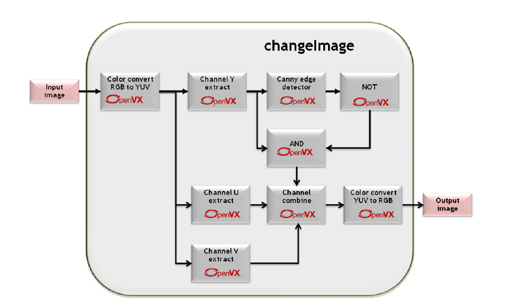

# openvx_ws
Common place for practising OpenVX related stuffs

## Install OpenVX 1.3 on Ubuntu 18.04

```
cd openvx_ws

git clone --recursive https://github.com/KhronosGroup/OpenVX-sample-impl.git

cd OpenVX-sample-impl/

python Build.py --os=Linux --arch=64 --conf=Debug --conf_vision --enh_vision --conf_nn

export OPENVX_DIR=$(pwd)/install/Linux/x64/Debug

export VX_TEST_DATA_PATH=$(pwd)/cts/test_data/

mkdir build-cts

cd build-cts

cmake -DOPENVX_INCLUDES=$OPENVX_DIR/include -DOPENVX_LIBRARIES=$OPENVX_DIR/bin/libopenvx.so\;$OPENVX_DIR/bin/libvxu.so\;pthread\;dl\;m\;rt -DOPENVX_CONFORMANCE_VISION=ON -DOPENVX_USE_ENHANCED_VISION=ON -DOPENVX_CONFORMANCE_NEURAL_NETWORKS=ON ../cts/

cmake --build .

LD_LIBRARY_PATH=./lib ./bin/vx_test_conformance
```
## Install OpenVX 1.2 on Ubuntu 18.04

```
cd openvx_ws

wget https://www.khronos.org/registry/OpenVX/sample/openvx_sample_1.2.tar.bz2

tar -xvf openvx_sample_1.2.tar.bz2

cd openvx_sample

python Build.py --os=Linux --tiling --openmp --conf=Debug --rebuild=True --c=gcc --cpp=g++

export LD_LIBRARY_PATH=$LD_LIBRARY_PATH:$(pwd)/install/Linux/x64/Debug/bin

export PATH=$PATH:$(pwd)/install/Linux/x64/Debug/include

export LDFLAGS=\"-L$(pwd)/install/Linux/x64/Debug/bin\"

export CFLAGS=\"-I$(pwd)/install/Linux/x64/Debug/include\"

make
```
## Run example code

### Running example1-3
```
cd openvx_ws

cd examples

mkdir build && cd build

gcc ../example1/example1.c -I ../../openvx_sample/include/ -L ../../openvx_sample/install/Linux/x64/Debug/bin/ -l openvx -L ../../openvx_sample/install/Linux/x64/Debug/bin/ -l vxu -o example1

./example1
```

### Running example4
```
cd build

gcc ../example4/example4.c -I ../../openvx_sample/include/ -L ../../openvx_sample/install/Linux/x64/Debug/bin/ -l openvx -o example4

./example4
```

### Running example4a

```
cd build

gcc ../example4/example4a.c ../../examples/ppm-io/writeImage.c -I ../../openvx_sample/include/ -I ../../examples/ppm-io/ -L ../../openvx_sample/install/Linux/x64/Debug/bin/ -l openvx -o example4a

./example4a
```
### Running changeImage

[](docs/changeImage.png)  

```
cd build 

gcc ../example4/changeImage.c ../../examples/ppm-io/readImage.c ../../examples/ppm-io/writeImage.c -I ../../openvx_sample/include/ -I ../../examples/ppm-io/ -L ../../openvx_sample/install/Linux/x64/Debug/bin/ -l openvx -o changeImage

 sudo apt-get install imagemagick

 convert image.png image.ppm

./changeImage image.ppm image_output.ppm
```